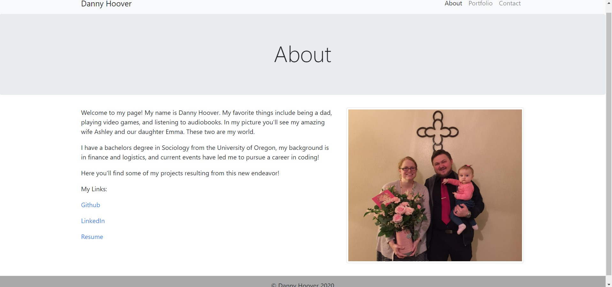
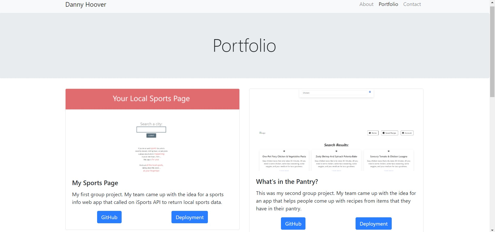

# React-Portfolio

This is a react version of my portfolio. Deployed Application: https://react-portfolio-dh.herokuapp.com/

We start at the intro page that shows some info about me, like my linkedin, github profile, and resume links.

The user can navigate to the portfolio page that has links to all of my above projects.

